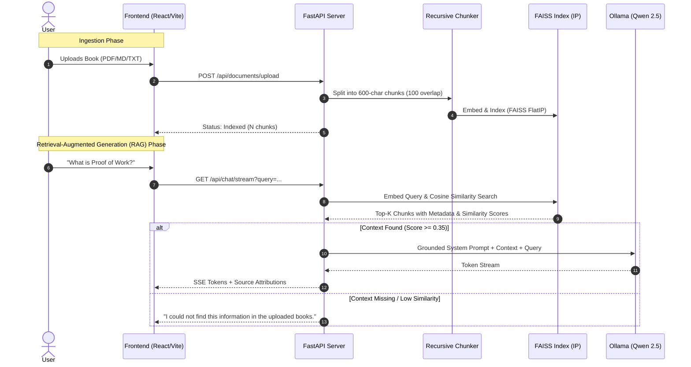

# 🏛️ BlockMind AI - Architectural Specification

## 1. Overview & Design Principles

BlockMind AI is designed around three architectural pillars:
1. **Zero-Cloud Dependency:** 100% of processing (text extraction, vector embedding, similarity search, prompt synthesis, and LLM inference) occurs locally on the user's hardware.
2. **Deterministic Grounding & Zero-Hallucination:** Answers are strictly synthesized from retrieved context chunks. If no relevant chunks surpass the cosine similarity threshold ($\ge 0.35$), the system issues a predefined safety notice.
3. **Low-Resource Optimization:** Operates with $< 1.5\text{ GB}$ RAM overhead and zero GPU requirement by utilizing lightweight embedding representations (`bge-small-en-v1.5`) and efficient quantization (`qwen2.5:1.5b-instruct-q4_K_M`).

---

## 2. Component Pipeline Breakdown



---

## 3. Vector Database & Embedding Details

- **Embedding Model:** `BAAI/bge-small-en-v1.5`
- **Vector Dimension:** 384 dimensions ($d = 384$).
- **Metric Space:** Inner Product (`IndexFlatIP`) operating on $L_2$-normalized vectors to compute true Cosine Similarity.
- **Chunking Strategy:** Recursive character splitting prioritizing Markdown headings (`#`, `##`), then paragraph boundaries (`\n\n`), followed by sentence punctuation (`.`, `!`, `?`).
- **Overlap:** 100 characters to maintain unbroken semantic continuity across boundaries.

---

## 4. Anti-Hallucination Guardrail Schema

The system enforces grounding through structured prompt engineering:
```
You are BlockMind AI, an authoritative Offline Blockchain Knowledge Assistant.
Answer strictly and only from the provided context below.
If the answer cannot be verified from the context, output:
"I could not find this information in the uploaded blockchain books."
```
