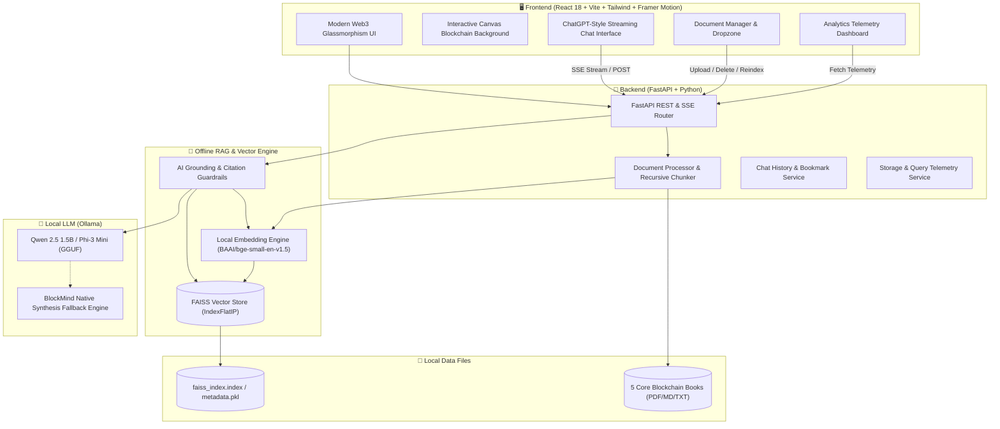

<div align="center">

# 🧠 BlockMind AI
### Offline AI Blockchain Knowledge Assistant Powered by Local RAG & FAISS

[](https://opensource.org/licenses/MIT)
[](https://python.org)
[](https://fastapi.tiangolo.com)
[](https://react.dev)
[](https://github.com/facebookresearch/faiss)
[](https://ollama.com)
[](#)

<p align="center">
  <b>100% Free • Zero Subscriptions • Zero Paid Cloud APIs • Fully Offline On-Device Execution</b>
</p>

<p align="center">
  A state-of-the-art, open-source AI assistant designed for students, researchers, and blockchain engineers. Answers questions exclusively grounded in 5 core blockchain books and whitepapers with strict zero-hallucination guardrails and precise source citations.
</p>

---

## 🌟 Key Highlights & Capabilities

- 🔒 **100% Offline & Private:** Runs entirely on your local machine (Windows, macOS, Linux). Zero data leaves your device.
- 💸 **Zero Cloud API Costs:** No OpenAI, Anthropic, Gemini, Pinecone, or Supabase subscriptions required.
- ⚡ **Hybrid RAG (FAISS + BM25 + Reciprocal Rank Fusion):** Combines dense semantic vector search with sparse keyword search to accurately pinpoint exact technical terms like `EIP-1559`, `secp256k1`, and Solidity opcodes.
- 🧠 **DeepSeek-R1 Reasoning & Thought Visualizer:** Supports DeepSeek-R1 reasoning models with real-time collapsible `<think>` process cards and cyberpunk animations.
- 🕸️ **Interactive Blockchain Knowledge Graph:** Visual HTML5 canvas network linking core blockchain concepts across all 5 indexed books with one-click AI query exploration.
- 🎓 **Student Study & Certification Quiz Engine:** Built-in interactive quiz and study flashcards with automated scoring, blockchain mastery rankings, and book citations.
- 📑 **Academic Citation Generator:** One-click copy for **BibTeX**, **APA 7th**, and **IEEE** citations formatted for academic papers and study notes.
- 🛡️ **Strict Anti-Hallucination Guardrails:** If information is not found in the indexed books, BlockMind explicitly informs you: *"I could not find this information in the uploaded blockchain books."*
- 🎨 **Modern Cyberpunk UI/UX:** Dark & Light modes, interactive canvas blockchain network background, glassmorphism, and Framer Motion transitions.
- 📊 **Telemetry Dashboard:** Live tracking of indexed books, chunk counts, query history, storage breakdown, and similarity match accuracy.

---

## 🏛️ System Architecture



---

## 📚 Included Starter Knowledge Books

BlockMind AI comes pre-loaded with 5 foundational blockchain works ready for instant indexing:

1. **Bitcoin: A Peer-to-Peer Electronic Cash System** *(Satoshi Nakamoto)*
   - Proof of Work, UTXO model, timestamp servers, halving mechanics, Merkle trees, and SPV.
2. **Mastering Ethereum and Smart Contract Architecture** *(Vitalik Buterin & Dr. Gavin Wood)*
   - EVM stack architecture, gas mechanics, EIP-1559, ERC-20/721 standards, and security vulnerabilities (Reentrancy, MEV).
3. **Blockchain Consensus Mechanisms: PoW, PoS, and BFT** *(Distributed Systems Research)*
   - Byzantine Generals Problem, Nakamoto consensus, Casper FFG, slashing conditions, Tendermint BFT, and the Blockchain Trilemma.
4. **Decentralized Finance (DeFi) Protocols and Primitives** *(DeFi Institute)*
   - Automated Market Makers (AMM x * y = k), impermanent loss, concentrated liquidity, over-collateralized lending, and flash loans.
5. **Layer 2 Scaling, Modular Blockchains & Zero-Knowledge Rollups** *(Cryptographic Scaling Forum)*
   - Optimistic Rollups vs ZK-Rollups, Fraud Proofs vs Validity Proofs (SNARKs/STARKs), EIP-4844 Proto-Danksharding, and Data Availability.

---

## 🚀 Quickstart & Installation

### Prerequisites
- **Python 3.10+**
- **Node.js 18+**
- *(Optional for GPU/LLM acceleration)*: [Ollama](https://ollama.com)

---

### One-Command Setup

#### Windows Users:
```cmd
start.bat
```

#### Linux & macOS Users:
```bash
chmod +x start.sh
./start.sh
```

---

### Manual Setup (Step-by-Step)

#### 1. Clone the Repository
```bash
git clone https://github.com/AlaminM01/BlockMind_AI.git
cd BlockMind_AI
```

#### 2. Setup & Start Backend
```bash
cd backend
python -m venv venv

# Windows:
venv\Scripts\activate
# Linux/macOS:
source venv/bin/activate

pip install -r requirements.txt
python app.py
```
*Backend API will be running on `http://127.0.0.1:8000`*

#### 3. Setup & Start Frontend
```bash
cd ../frontend
npm install
npm run dev
```
*Frontend UI will be running on `http://localhost:5173`*

#### 4. (Optional) Run Local LLM with Ollama
```bash
# Pull lightweight Qwen 2.5 1.5B Instruct model (approx. 980MB)
ollama pull qwen2.5:1.5b

# Or pull Phi-3 Mini
ollama pull phi3:mini
```

> **Note:** Even if Ollama is not installed or running, BlockMind AI features an integrated local offline synthesis engine that extracts and constructs grounded answers directly from the FAISS vector database.

---

## 🐳 Docker Deployment

Run the entire stack with a single command:

```bash
docker-compose up -d --build
```

Access the frontend at `http://localhost:5173` and backend API at `http://localhost:8000/docs`.

---

## 📸 Feature Walkthrough

| Feature | Description |
| :--- | :--- |
| **Grounded AI Chat** | ChatGPT-style interface with real-time token streaming and citation pills for source verification. |
| **Source Inspector Modal** | Inspect raw text chunks, chapter metadata, and exact similarity match percentages (e.g. 96%). |
| **Knowledge Base Dropzone** | Ingest new PDF books, text whitepapers, or markdown documents with automatic recursive chunking. |
| **Analytics Dashboard** | Live telemetry tracking indexed chunks, storage footprint, query topic distribution, and search logs. |
| **Multi-Format Export** | Download your research chats as formatted PDF reports, Markdown documents, or JSON files. |
| **Bookmarks Vault** | Save, tag, and search crucial blockchain answers for revision and exam prep. |

---

## 🛠️ Technology Stack

| Layer | Technology |
| :--- | :--- |
| **Frontend Framework** | React 18, Vite |
| **Styling & UI** | Tailwind CSS (Cyberpunk Theme), Glassmorphism |
| **Motion & Animation** | Framer Motion, HTML5 Interactive Canvas |
| **Icons** | Lucide React |
| **Backend Framework** | Python 3.11, FastAPI, Uvicorn |
| **Vector Database** | Facebook AI Similarity Search (FAISS) |
| **Embedding Model** | BAAI/bge-small-en-v1.5 (384-dimensional) |
| **Document Parsers** | PyPDF, Markdown, UTF-8 Text Handlers |
| **Local LLM Engine** | Ollama (Qwen 2.5 1.5B / Phi-3 Mini / Llama 3.2) |

---

## 🤝 Contributing

Contributions are warmly welcomed! Please read our [CONTRIBUTING.md](CONTRIBUTING.md) to get started.

1. Fork the Project
2. Create your Feature Branch (`git checkout -b feature/AmazingFeature`)
3. Commit your Changes (`git commit -m 'feat: Add AmazingFeature'`)
4. Push to the Branch (`git push origin feature/AmazingFeature`)
5. Open a Pull Request

---

## 📄 License

Distributed under the **MIT License**. See [LICENSE](LICENSE) for more information.

<div align="center">
  <sub>Built with 💙 for the Open-Source Blockchain Community by Alamin Mondal</sub>
</div>
